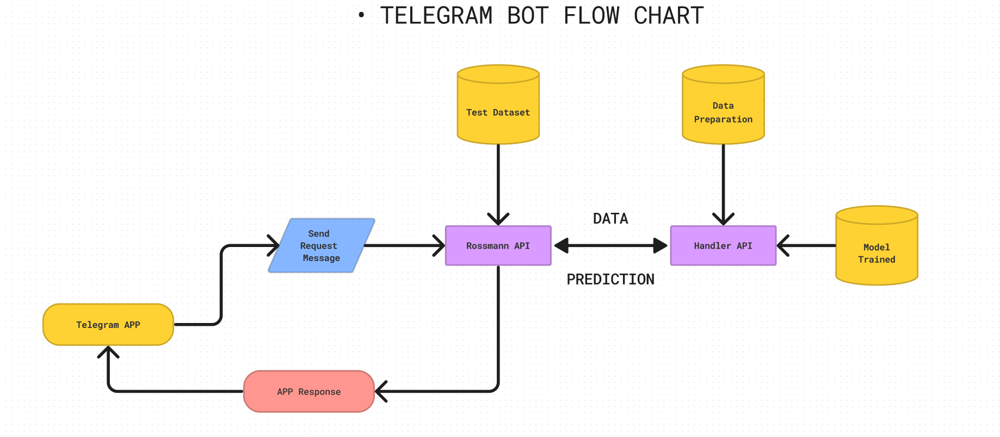

<h1 align="center">Rossmann Sales Forecast</h1>

# Welcome to my Rossmann business portfolio project.

## 1.0 Business Problem

The Rossmann business team wants to estimate the sales revenue of each store for the next six weeks in order to identify which stores would have enough revenue for new investments.

## 1.1 Business Context

In this database, we will find 1,017,209 entries dating from 01/01/2013 to 07/31/2015. These are data from over 3000 stores in 7 different countries.

## 1.2 Understanding and Business Problem Challenge

With thousands of individual managers predicting sales based on their work environment, the accuracy of the results can vary greatly, which would hinder the business team's decision-making process. The data team has been tasked with analyzing and developing a solution that is feasible for the entire network of stores.

## 2. Preparatory Planning

### CRISP-DM Method

## 2.1 Tools, IDEs, and Libraries

* Python 3.10
* Visual Studio Code
* Jupyter Notebook
* PyCharm Community Ed.
* Libraries: Seaborn, Plotly, Plotly Express, Pandas, Numpy, Pickle, Streamlit, Boruta, XGBoost, SKLearn, and Matplotlib
* Final deployment using Streamlit Web Apps

## 2.2 Final Product

* Provide insights.
* Develop a sales prediction solution that is fast and practical, accessible from anywhere and any internet-connected device.

## 3.0 Business Study

The stores of the German network Rossmann, which sell hygiene items, snacks, household goods, basic clothing, and beverages, are the companion for all hours for those traveling to Germany. Branches are located in the subway and train stations of Hannover and throughout the streets. The express version operates until late at night. The prices are an extra reason to enter with every step. Going to Germany and not entering a Rossmann is like not going to the largest European economy.

**Source:** [Jornal do Comércio](https://www.jornaldocomercio.com/_conteudo/especiais/hannover_messe_2019/2019/04/678068-dicas-de-hannover.html)

## 4.0 Data

##### This data is publicly available and was collected from the [Kaggle](https://www.kaggle.com/c/rossmann-store-sales) webpage.

## 4.1 Source Attributes

Below is the description for each of the 15 attributes:

| **Attribute**         |  **Description**  |
| ----------------------|------------------------------------------------------------------------------------------|
|  id                   | an Id representing a (Store, Date) concatenated within the test set |
|  Store                | a unique id for each store |
|  Sales                | the sales volume on a given day |
|  Customers            | the number of customers on a given day |
|  Open                 | an indicator to know if the store was open: 0 = closed, 1 = open |
|  StateHoliday         | indicates a state holiday. Typically, all stores, with a few exceptions, are closed on state holidays. Note that all schools are closed on public holidays and weekends. a = public holiday, b = Easter holiday, c = Christmas, 0 = None |
| SchoolHoliday         | indicates if (Store, Date) was affected by the closure of public schools |
|  StoreType            | differentiates between 4 different store models: a, b, c, d |
|  Assortment           | describes the level of assortment: a = basic, b = extra, c = extended |
|  CompetitionDistance  | distance in meters to the nearest competing store |
|  CompetitionOpenSince | approximates the year and month when the nearest competitor was opened |
|  Promo                | indicates if a store is running a promotion on that day |
|  Promo2               | Promo2 is a continuous and consecutive promotion for some stores: 0 = the store is not participating, 1 = the store is participating |
|  Promo2Since          | describes the year and week when the store started participating in Promo2 |
|  PromoInterval        | describes the consecutive intervals when Promo2 is started again, naming the months in which the promotion starts. For example, "Feb, May, Aug, Nov" means that each round starts in February, May, August, November of any year for that store |

## 4.2 Created Attributes

* competition_open_since_month -> The number of months since a nearby competing store was opened.
* competition_open_since_year -> The number of years since a nearby competing store was opened.
* promo2_since_week -> The number of weeks since the last Promo2 promotion.
* promo2_since_year -> The number of years since the last Promo2 promotion.
* promo_interval -> The interval between promotions at the same store.
* month_map -> Mapping of months: 1: 'Jan', 2: 'Feb', 3: 'Mar', 4: 'Apr', 5: 'May', 6: 'Jun', 7: 'Jul', 8: 'Aug', 9: 'Sep', 10: 'Oct', 11: 'Nov', and 12: 'Dec'

## 4.3 Mind Map for Hypothesis/Insights Creation

## 5.0 Assumptions

- For stores that had no information on 'Competition Distance', the largest observed distance in the dataset was considered.
- Only stores with sales values greater than 0 were considered.
- Days when stores are closed were excluded from the analysis.

## 6.0 Key Insights

### 1. Do stores with a larger assortment sell more?

-> The hypothesis is FALSE. Stores with a larger assortment actually SELL LESS overall.

### 2. Do stores with closer competitors sell less?

-> The hypothesis is FALSE. Stores with CLOSER COMPETITORS actually SELL MORE.

### 3. Do stores with competitors open for a longer time sell more?

-> The hypothesis is FALSE. Stores with competitors open for a longer time actually SELL LESS.

### 4. Do stores with longer active promotions sell more?

-> The hypothesis is FALSE. After a certain period of promotion, stores start to sell LESS.

### 5. Do stores with consecutive promotions sell more?

-> The hypothesis is FALSE. Stores with consecutive promotions actually sell LESS.

### 6. Do stores open during the Christmas holiday sell more?

-> The hypothesis is FALSE. Stores open during the Christmas holiday actually sell LESS.

### 7. Are stores selling more over the years?

-> The hypothesis is FALSE. Sales are decreasing over the years.

### 8. Do stores sell less on weekends?

-> The hypothesis is TRUE. Stores sell LESS on weekends.

### 9. Do stores sell more after the 10th day of the month?

-> The hypothesis is TRUE. Stores sell MORE after the 10th day of the month.

## 7.0 Data Modeling

In this stage, the data was prepared for the implementation of Machine Learning models. Rescaling and transformation techniques were used, including encodings and nature transformation. The Boruta package was applied to identify the best attributes and train the best model to achieve higher accuracy.

## 7.1 Machine Learning Modeling

In this process of choosing Machine Learning models, tests and training were performed with five models: Random Forest Regressor, XGBoost Regressor, Linear Regression (Lasso), Linear Regression, and Average Model. I used the Average Model as a baseline to compare with the other models. Cross-validation technique was applied to ensure real performance on the selected data. In terms of performance, the Random Forest Regressor performed the best. However, I chose the XGBoost Regressor as the final model. The reason for this choice is that XGBoost is a lighter model to operate in production and does not show a significant difference in performance.

## Performance

## Cross Validation Performance

## 8.0 Algorithm Evaluation

Hyperparameter Tuning:

Here, I conducted several performance tests by adjusting the algorithm's parameters. I used the Random Search technique to find the best final settings. In the end, XGBoost's accuracy was in the best position, allowing me to save time and money as I did not need heavy computational resources like cloud computing instances for running more resource-intensive tests.

Test Data Performance:

## 8.1 Translation and Interpretation of Errors

Now, I present the final results of the project, evaluating the model's performance with a business perspective. Here, I present the financial outcome and the model's error margins for both the best-case scenario and the worst-case scenario. The total values represent the sum of all store sales for the next six weeks.

## Machine Learning Model Predictions

In this final step, I implemented a Telegram bot that allows any user with internet access to request predictions from the Machine Learning model. This process is done individually, meaning that predictions can be requested for each individual store in the sales network. The bot was created within the Telegram platform and connected to the Render Cloud service. The prediction model in Python is now operational 24/7.

