 <h1 align="center"> Rossmann Sales Forecast </h1>

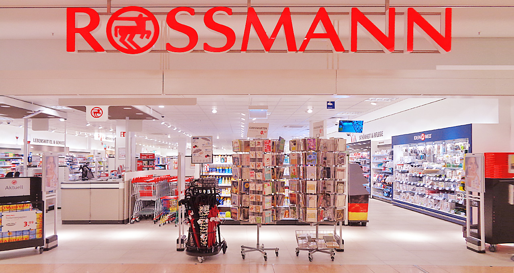

# Sejam bem-vindos ao meu projeto de portfólio de negócio da empresa Rossmann.

## 1.0 O Problema do Negócio

O time de negócios da Rossmann quer estimar o faturamento de cada loja nas próximas seis semanas, com objetivo de identificar quais lojas teriam faturamento suficiente para realizar novos investimentos.

## 1.1 Contexto do Negócio

Nesse banco de dados iremos encontrar 1.017.209 entradas que datam de 01/01/2013 até 31/07/2015. São dados de mais de 3000 lojas em 7 diferentes países.

## 1.2 Entendimento e Desafio do Problema de Negócio

Com milhares de gerentes individuais prevendo vendas com base em seu ambiente de trabalho, a precisão dos resultados podem sofrer muitas variações e, isso prejudicaria na tomada de decisão do time de negócios. 
Diante dessa situação o time de dados ficou encarregado de analisar e desenvolver uma solução que seja viável para toda a rede de atendimento. 

## 2. Planejamento prévio

### Método CRISP-DS

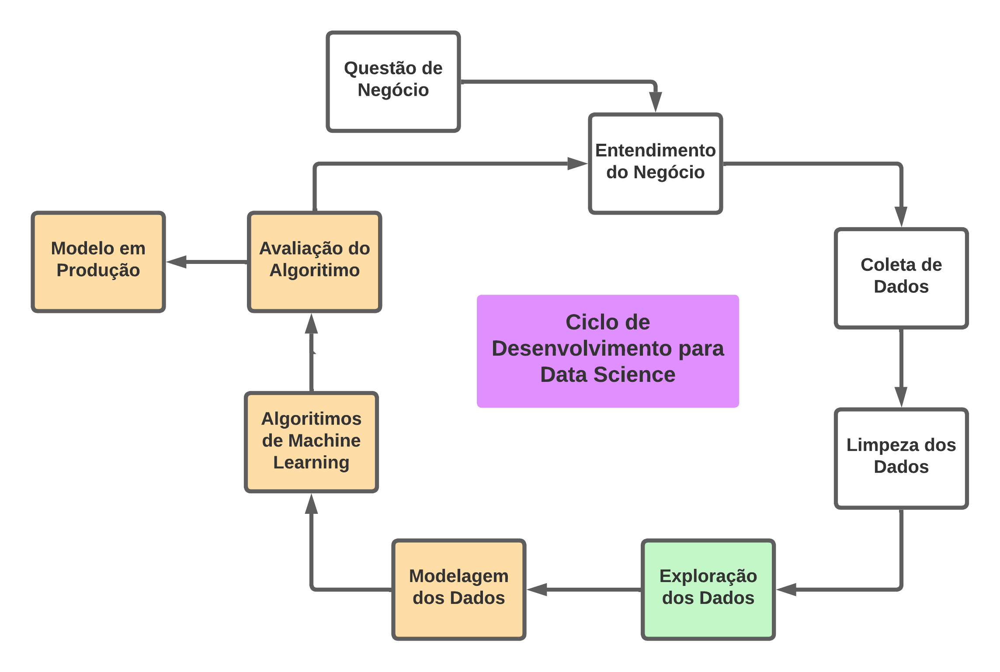

## 2.1 Ferramentas, IDE's e Bibliotecas

* Python 3.10
* Visual Studio Code
* Jupyter Notebook
* PyCharm Community Ed.
* Bibliotecas: Seaborn, Plotly, Plotly Express, Pandas, Numpy, Pickle, Streamlit, Boruta, XGBoost, SKLearn e MatPlotLib
* Deploy final Streamlit Web Apps

## 2.2 Produto final

* Solucionar Insights.
* Desenvolver uma solução de predição de vendas. Esta, deve ser rápida e prática, podendo ser acessada de qualquer lugar e de qualquer dispositivo conectado a internet.

## 3.0 Estudo do negócio

As lojas da rede alemã Rossmann, que vendem itens de higiene, comidinhas, coisas para casa, roupas básicas e bebidas, são a companheira para todas as horas de quem viaja para a Alemanha. Filiais estão na estação de metrô e trens de Hannover e pelas ruas. A versão express funciona até tarde da noite. Os preços são motivo extra para entrar a cada passada. Ir a Alemanha e não entrar em uma Rossmann e como não ir à maior economia europeia.

**Fonte:** [ Jornal do Comércio ](https://www.jornaldocomercio.com/_conteudo/especiais/hannover_messe_2019/2019/04/678068-dicas-de-hannover.html)

## 4.0 Dados

##### Estes são dados públicos que foram coletados na página web do [Kaggle](https://www.kaggle.com/c/rossmann-store-sales).

## 4.1 Atributos de origem

 Abaixo segue a descrição para cada um dos 15 atributos:  
| **Atributos**         |  **Descrição**  |
| ----------------------|------------------------------------------------------------------------------------------|
|  id                   | um Id que representa um (Store, Date) concatenado dentro do conjunto de teste |
|  Store                |  um id único para cada loja |
|  Sales                |  o volume de vendas em um determinado dia |
|  Customers            |  o número de clientes em um determinado dia |
|  Open                 |  um indicador para saber se a loja estava aberta: 0 = fechada, 1 = aberta |
|  StateHoliday         |  indica um feriado estadual. Normalmente todas as lojas, com poucas exceções, fecham nos feriados estaduais. Observe que todas as escolas fecham nos feriados e finais de semana. a = feriado, b = feriado da Páscoa, c = Natal, 0 = Nenhum |
| SchoolHoliday         |  indica se (Store, Date) foi afetada pelo fechamento de escolas públicas |
|  StoreType            |  diferencia entre 4 modelos de loja diferentes: a, b, c, d |
|  Assortment           |  descreve um nível de sortimento: a = básico, b = extra, c = estendido |
|  CompetitionDistance  |  distância em metros até a loja concorrente mais próxima |
|  CompetitionOpenSince |  apresenta o ano e mês aproximados em que o concorrente mais próximo foi aberto |
|  Promo                |  indica se uma loja está fazendo uma promoção naquele dia |
|  Promo2               |  Promo2 é uma promoção contínua e consecutiva para algumas lojas: 0 = a loja não está participando, 1 = a loja está participando |
|  Promo2Since          |  descreve o ano e a semana em que a loja começou a participar da Promo2 |
|  PromoInterval        | descreve os intervalos consecutivos de início da promoção 2, nomeando os meses em que a promoção é iniciada novamente. Por exemplo. "Fev, maio, agosto, novembro" significa que cada rodada começa em fevereiro, maio, agosto, novembro de qualquer ano para aquela loja |

## 4.2 Atributos criados

* competition_open_since_month -> A quantidade de meses desde de que uma loja competidora próxima foi aberta.
* competition_open_since_year -> A quantidade de anos desde de que uma loja competidora próxima foi aberta.
* promo2_since_week -> A quantidade de semanas desde a última promoção categoria 2.
* promo2_since_year -> A quantidade de anos desde a última promoção categoria 2.
* promo_interval -> O intervalo entre promoções na mesma loja
* month_map -> Mapeamento dos meses 1: 'Jan', 2: 'Fev', 3: 'Mar', 4: 'Apr', 5: 'May', 6: 'Jun', 7: 'Jul', 8: 'Aug', 9: 'Sep', 10: 'Oct', 11: 'Nov' e 12: 'Dec'

## 4.3 Mapa Mental para Criação de Hipóteses/Insights

## 5.0 Premissas

- Para as lojas que não possuíam informações de 'Competition Distance', foi considerado a maior distância observada no conjunto de dados.
- Foram consideradas apenas lojas com valores de venda maior que 0.
- Os dias em que as lojas estão fechadas foram retiradas da análise.

## 6.0 Principais Insights

### 1. Lojas com maior sortimentos vendem mais?

-> A hipótese é FALSA. As lojas que possuem maior sortimento VENDEM MENOS no geral.

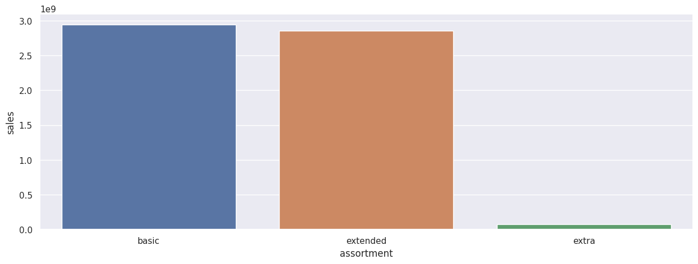

### 2. Lojas com competidores mais próximos vendem menos?
-> A hipótese é FALSA. Lojas com COMPETIDORES MAIS PRÓXIMOS VENDEM MAIS.

### 3. Lojas com competidores há mais tempo vendem mais?
->  A hipótese é FALSA. Lojas com competidores há mais tempo VENDEM MENOS.

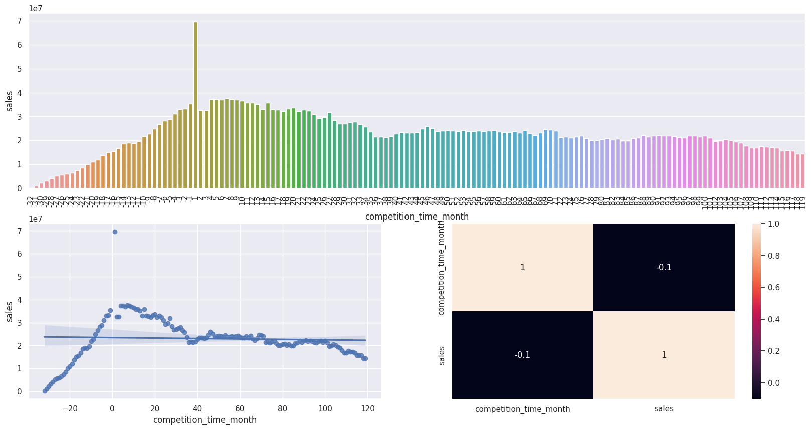

### 4. Lojas com promoções ativas por mais tempo vendem mais?
-> A hipótese é FALSA. Depois de um certo período de promoção as lojas passam a vender MENOS.

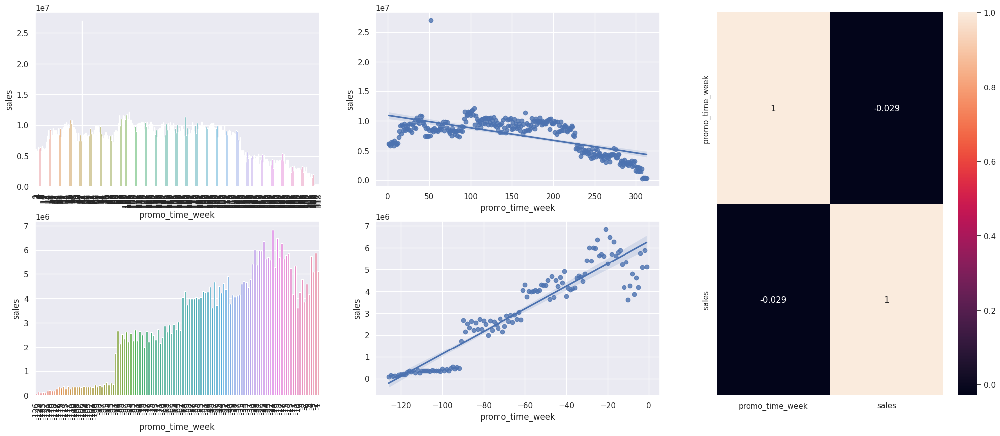

### 5. Lojas com promoções consecutivas vendem mais?
-> A hipótese é FALSA. As lojas com promoções consecutivas vendem MENOS.

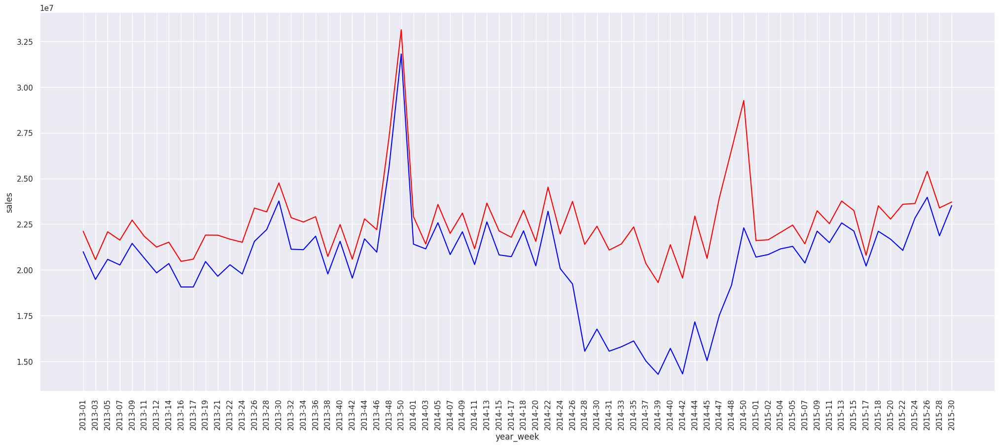

### 6. Lojas abertas durante o feriado do Natal vendem mais?
-> A hipótese é FALSA. As lojas abertas durante o feriado do Natal vendem MENOS.

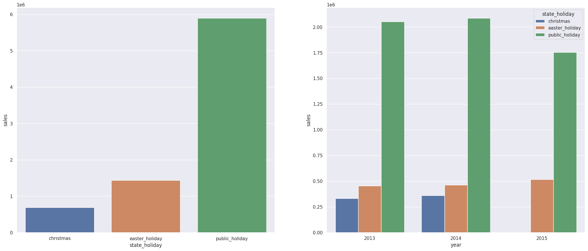

### 7. As lojas estão vendendo mais ao longo dos anos?
-> A hipótese é FALSA. As vendas estão diminuindo ao longo dos anos.

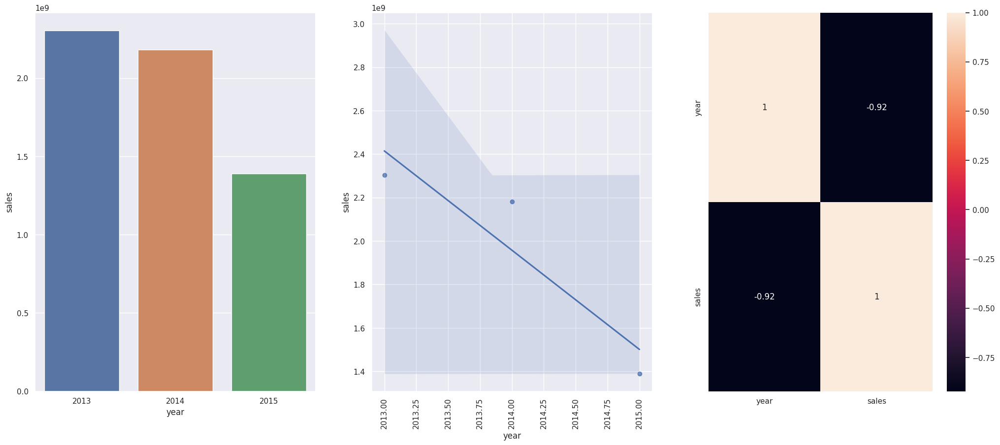

### 8. Lojas vendem menos nos finais de semana?
-> A hipótese é VERDADEIRA. As lojas vendem MENOS nos finais de semana.

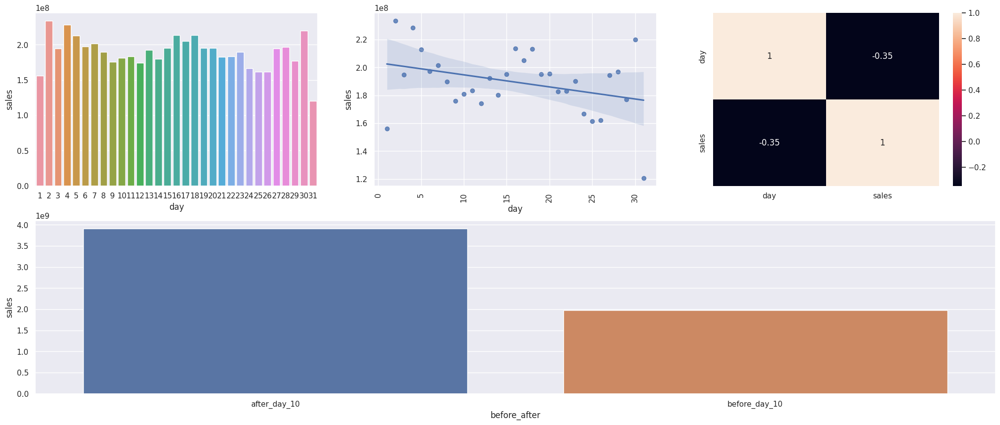

### 9. Lojas vendem mais depois do 10º dia do mês?
-> A hipótese é VERDADEIRA. As lojas vendem MAIS depois do 10º do mês.

## 7.0 Modelagem dos dados

Nesta etapa, os dados foram preparados para o início das aplicações dos modelos de Machine Learning. 
Foram utilizadas técnicas de Rescaling e Transformation, através de encodings e nature transformation. O pacote Boruta foi aplicado para direcionar quais são os melhores atributos e, dessa maneira, treinar o melhor modelo afim de se obter uma melhor acurácia.

## 7.1 Machine Learning Modeling

Nesse processo de escolha de modelos de Machine Learning, foram relizados testes e treinamentos com cinco deles, são os seguintes: Random Forest Regressor, XGBoost Regressor, Linear Regression (Lasso), Linear Regression e Average Model. 
Utilizei o Average Model como base para fazer comparações com os demais modelos. 
Apliquei a técnica de Cross Validation para garantir a performance real sobre os dados selecionados. 
Em termos de performance, o Random Forest Regressor se saiu melhor, todavia, eu escolhi o modelo XGBoost Regressor. 
A razão dessa escolha é que o XGBoost é um modelo mais leve para operar em produção e não aparesenta diferença significativa de desempenho.

## Performance

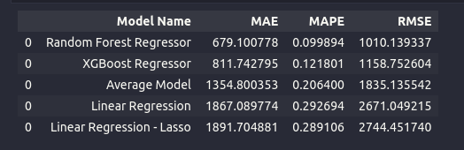

## Cross Validation Performance

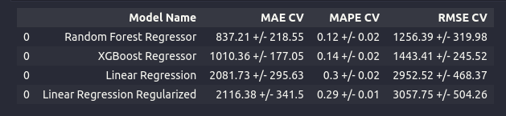

## 8.0 Avaliação do Algorítimo

Hyperparameter Tunning:

Aqui eu realizei diversos testes de desempenho a partir das variações de ajustes dos parâmetros do algoritmo, fiz o uso da técnica de Random Search para poder encontrar os melhores ajustes finais. No final a acurácia do XGBoost ficou na melhor posição e pude economizar tempo e dinheiro, já que não foram necessárias máquinas de Cloud Computing para poder executar os testes mais pesados, computacionalmente falando.

Desempenho dos dados de teste:

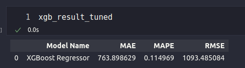

## 8.1 Tradução e interpretação de erros

Chegamos então a demonstração do resultado final do projeto. Avaliei a performance do modelo com viés voltado ao negócio. 
Aqui apresento o resultado financeiro e as margens de erro do modelo, tanto para o melhor cenário, quanto para o pior cenário. 
Os valores totais representam a soma de todo o faturamento das lojas para as próximas seis semanas.

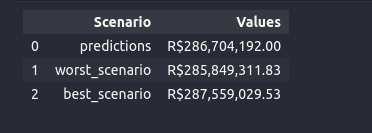

## Predições do Modelo de Machine Learning

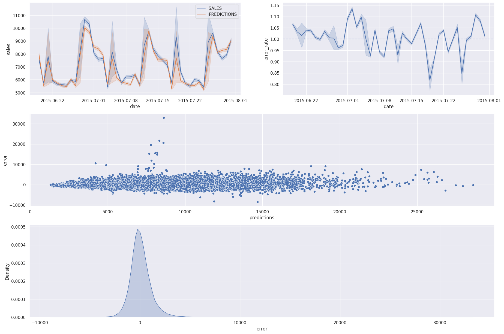

## 9.0 Implementação do bot no Telegram

Neste último passo realizei a implementação de um bot no Telegram para que qualquer usuário com acesso à internet possa solicitar os resultados das predições do modelo de Machine Learning. Este processo é realizado individualmente, ou seja, pode ser solicitada a prediçao por loja única da rede de vendas. 
O bot foi criado dentro da própria plataforma do Telegram e o mesmo foi conectado ao serviço de Cloud do Render. O modelo de predição em Python passa então a operar 24/7.

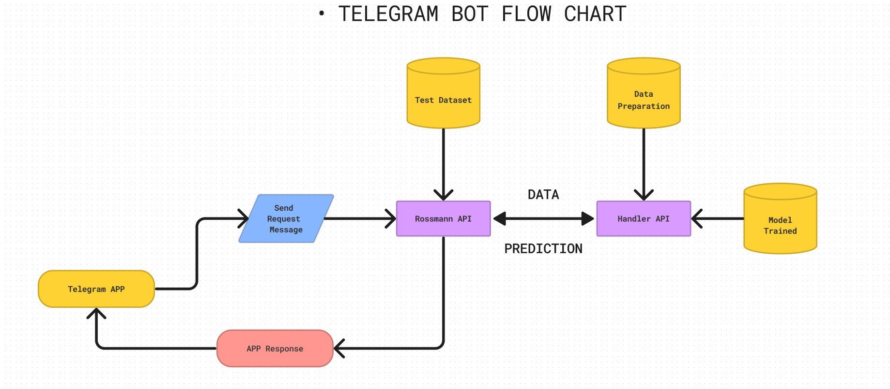
